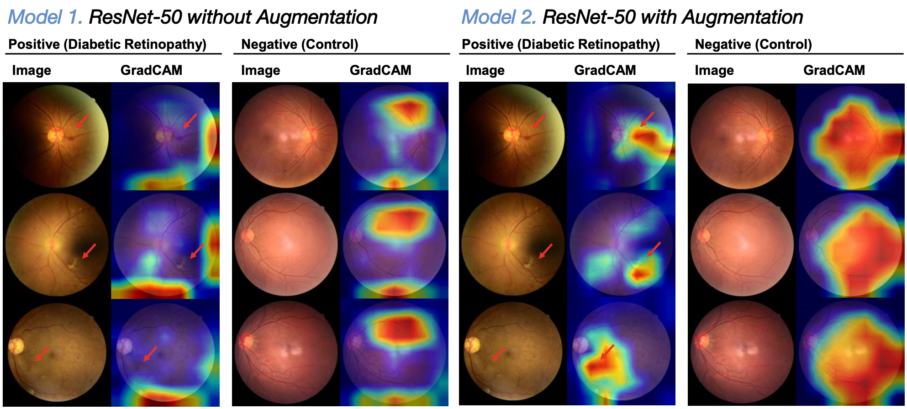
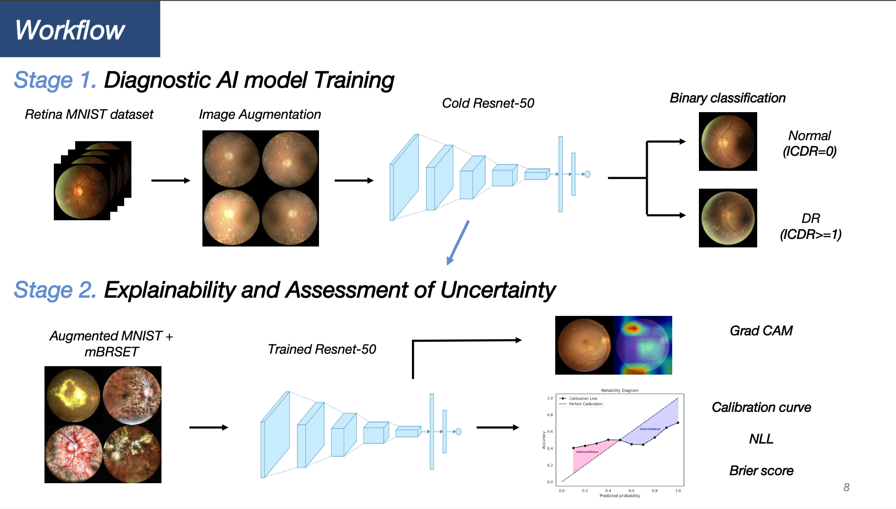
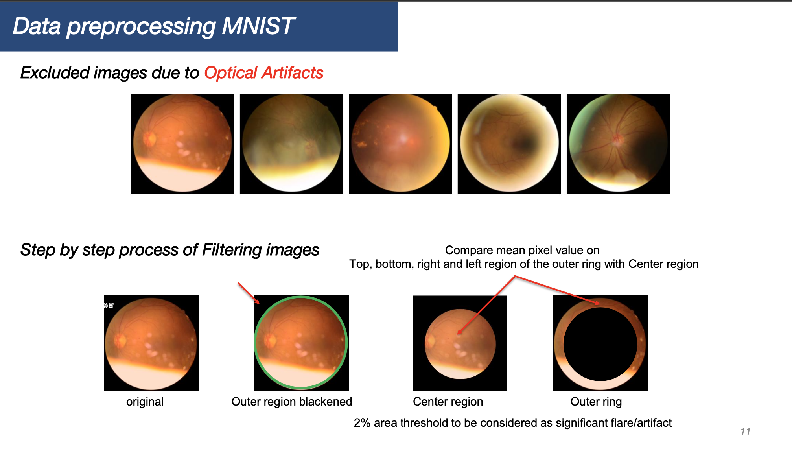

# Trustworthiness and Uncertainty in Medical AI: A Case Study Using a Diabetic Retinopathy Dataset

**Hyunmin Choi, Hojun Jeong, Hyungjin Yoon, Minseok Han, Junsoo Seo, Minkyeong Kim** <sub>All authors contributed equally</sub>



---

### Summary



This project builds a reliable end-to-end pipeline for diabetic retinopathy (DR) screening that centers data quality, calibration, and interpretability. We re-labeled RetinaMNIST using ICDR grades (0–4), collapsing grades 1–4 into DR-positive and grade 0 into non-DR to form a clinically meaningful binary task. To control input quality, we targeted common optical artifacts: we first detected the circular fundus boundary and blackened all pixels outside it to remove text/markings; then we screened for crescent-shaped flare by comparing mean intensities in the outer ring (top/bottom/left/right) against the center. These procedures (see p.11 and the logic in `src/Preprocess.py`) reduce non-pathological cues and lighting bias before training.



We trained ResNet-50 on RetinaMNIST and then transferred/fine-tuned to the Brazil mBRSET dataset to assess domain robustness (portable camera vs. curated data). Generalization was strengthened with a diverse augmentation stack (as on p.12): rotations, horizontal/vertical flips, random crop/resize, color jitter, and random erasing. Qualitatively, Grad-CAM maps show that augmentation helps the model focus on clinically plausible retinal regions across DR-positive and control cases.

Beyond accuracy, we emphasized trustworthy probabilities. We implemented deep ensembles and Monte Carlo Dropout (p ∈ {0.001, 0.01, 0.1, 0.2}) and evaluated Expected Calibration Error (ECE), Brier score, and Negative Log-Likelihood (NLL). **MC Dropout yielded only marginal improvements in Brier and ECE—alongside small gains in Accuracy within our uncertainty-evaluation setup—while we also observed a slight decrease in peak accuracy compared with a fully committed CNN trained/evaluated without dropout.** We therefore explored multiple dropout rates and ensemble sizes to characterize this trade-off. Grad-CAM visualizations complement these findings by highlighting decision-relevant retinal regions, supporting transparent model behavior.

---

### Overview & Contributions

* End-to-end DR classification pipeline with transfer learning.
* Careful preprocessing for fundus boundary detection and artifact removal.
* Data augmentation strategies to improve generalization.
* Uncertainty quantification through deep ensembles and MC Dropout.
* Calibration assessment using ECE, Brier score, and NLL.
* Grad-CAM visualizations for interpretability.

---

### Repository Structure

```
notebooks/   # training, evaluation, and figure reproduction
src/         # models, dataset loaders, preprocessing, training loops
utils/       # metrics, plotting, helper functions
```

---

### Data Setup

* **RetinaMNIST**: downloaded and re-labeled using ICDR 0–4 scale (0 = non-DR, 1–4 = DR).
* **mBRSET**: portable-camera DR dataset for external validation.
* Preprocessing (p.11): fundus outline detection, blackening outside pixels, crescent artifact removal.

---

### Training Procedure

* **Stage 1 (RetinaMNIST)**: Train ResNet-50 with/without augmentation.
* **Stage 2 (mBRSET)**: Transfer learning and fine-tuning.
* **Augmentations (p.12)**: rotation, flipping, cropping/resizing, color jitter, random erasing.

---

### Uncertainty & Calibration

* **Deep Ensembles**: train multiple ResNet-50 instances.
* **MC Dropout**: inference with dropout p = {0.001, 0.01, 0.1, 0.2}.
* Metrics: Expected Calibration Error (ECE), Brier score, Negative Log-Likelihood (NLL).
* Trade-off: marginal metric gains but slight decrease in peak accuracy.

---

### Results

* **Accuracy and F1**: improved with augmentation and transfer learning.
* **Uncertainty metrics**: MC Dropout gave small improvements in Brier/ECE, ensembles more stable.
* **Limitations**: minor decrease in accuracy compared to dropout-free CNN baselines.

---

### Figures

*  *(from p.3)*
*  *(from p.4)*
*  *(from p.6)*
*  *(from p.7)*

(*Replace these placeholders with actual extracted figures from the PDF.*)

---

### Citation

If you use this repository, please cite as:

```bibtex
@misc{digitalhealthcarebootcamp2025,
  title        = {Trustworthiness and Uncertainty in Medical AI: A Case Study Using a Diabetic Retinopathy Dataset},
  author       = {Choi, Hyunmin and Jeong, Hojun and Yoon, Hyungjin and Han, Minseok and Seo, Junsoo and Kim, Minkyeong},
  year         = {2025},
  note         = {Digital Health Care Bootcamp 2025, Yonsei University College of Medicine},
  url          = {https://github.com/youravgENTP/DigitalHeatlhCareBootcamp_2025_Winners}
}
```

---

### Acknowledgements

We acknowledge the Digital Health Care Bootcamp (Yonsei University College of Medicine), RetinaMNIST and mBRSET dataset creators, and the broader research community whose methods and datasets enabled this project.
